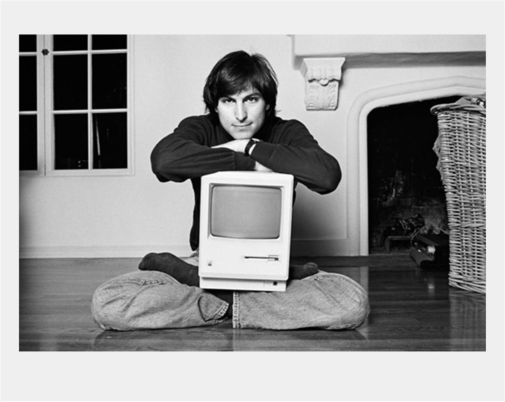

# 关于我

高中时热爱文学，在大学选专业时被家人推荐选择了计算机，恰逢 **iPhone** 大火时机，了解到了 **Apple** 的生态，从此便入坑了，非常迷恋乔老爷子的科技与人文相结合。在大三时自学了 **iOS** 开发，实习到毕业前两年工作做的都是 iOS 开发相关工作。后面大前端之势开始火热，又自学了前端，从 vue 到 react，都有涉猎，现在是坚定的 **React hooks** 的拥趸。

平时还是比较喜欢关注一些咖啡，露营，穿搭类或者美食类的 up 主，2021 年最喜欢的 up 主非[波叔](https://weibo.com/bopular)莫属。

入坑了手冲，最爱的豆子是耶加雪菲的 soe。冰美式支持者，热拿铁爱好者。可乐只选可口可乐。

平时喜欢逛[即刻](https://m.okjike.com/users/9418827E-1393-414F-951A-F8244FE2EE8A?ref=PROFILE_CARD&utm_source=user_card)，少数派，v2ex, github 等社区。

平时喜欢关注一些效率型的工具。Alfred ，bear， notion，都是我比较喜欢的软件。

最近一个长时间开始实践反抗算法，避免自己形成信息茧房。使用 RSS ，通过 Reeder 来主动订阅自己喜欢的资源，这里推荐一个工具 [RSS Hub](https://docs.rsshub.app/)，可以通过自建 RSS 订阅规则来订阅信息源。入手了一个墨案的电纸书，在上面通过微信读书看书籍。下面是我自己的[读书书单](https://vaezc.notion.site/71000180f9fe421cb2da0b129b709323?v=afbcd8f7d5e346a280180210acd97cdb)。

相信一个理念，人脑适合检索不适合去记忆，任何知识都是需要通过一个体系化的东西去建立，才能做到举一反三，学海无涯，而生无涯。最近一直在尝试在 notion 上面建立起自己的第二大脑，去建立更加体系化的知识体系。

哲学是人类唯一的解药，感谢刘擎老师，感谢他的《西方现代思想讲义》 带我走出了一段迷雾时光。
