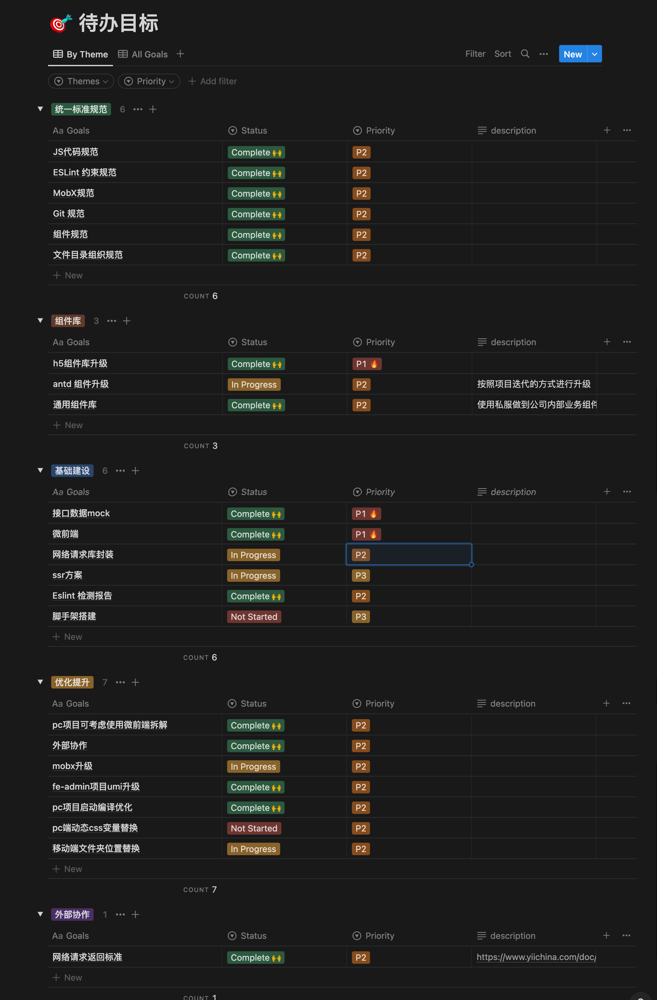
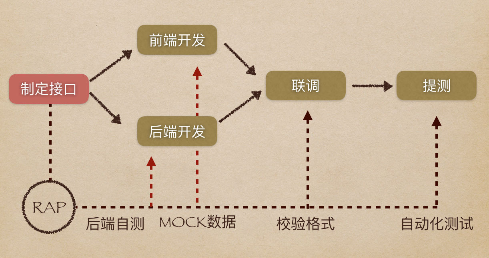
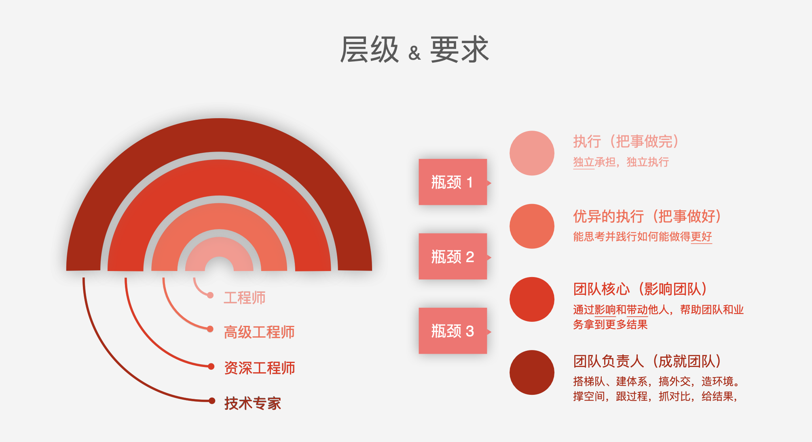

# 2023 总结

## 工作

从入职公司到年底共有一年时间，回顾这一年时间，按照时间节点大概分为几个阶段：
刚入职公司时：
前端组员七名，召集大家针对前端开发过程中存在的问题进行讨论和反馈，将总结出来的问题罗列出来，并根据问题的紧急性做出优先级排序。
并针对不同人员的水平和当前的状况进行培养计划。

优先解决了一些规范和流程化的问题，并输出文档。在钉钉文档中初步建立前端开发规范文档和开发流程以及提效方式。

后续解决一些影响开发效率或者容易导致线上 bug 的问题

1. 所有项目接入 ESlint ，在编码阶段提示代码中存在的问题，避免问题带到生产阶段。
2. h5 项目组件库版本低，迭代时需要手写组件影响开发进度，引入 antd mobile 最新的组件库，提升开发效率，不用每次迭代都需要重复造轮子。
3. 整理 git 工作流程，将原本手动打包上传到 oss 迁移到云效，避免因为手动操作上传 oss 导致的发布问题。
4. 根据公司当前使用的接口管理平台，整理出 mock 方案，在后端接口文档给出后，前端可以通过 mock 接口进行开发页面，减少后续接口联调时间。
   
5. h5 项目因为嵌入到不同应用的 webview 中调试比较困难，分享腾讯课堂开源的调试工具 whistle （[GitHub - avwo/whistle: HTTP, HTTP2, HTTPS, Websocket debugging proxy](https://github.com/avwo/whistle)），提升移动端开发同事定位线上问题的效率。
6. 钉钉小程序需要手动打包然后上传到钉钉管理后台，无法和现有的 git 分支管理模式进行迭代，通过研究流水线 docker 部署，将钉钉 cli 工具通过 docker 进行打包，上传到管理后台。
7. 微信小程序有多个站点，每次打包需要手动去选择不同站点进行打包，然后在本地上传，整个过程耗时长且容易发生错误，研究流水线的环境变量后，通过微信小程序的 ci 工具结合流水线的环境变量功能，通过流水线来自动化整个流程，减少了人为的干预，避免错误的产生，后续只要流水线部署成功后，在微信管理后台点击提交审核就完成了提审流程。
8. 修改微信小程序编译过程，之前小程序无法通过编译时真机调试，后续通过压缩包体积，可以在开发过程中使用真机调试微信小程序，避免了一些发布后通过真机才能复现的问题。
9. 前端构建工具版本不统一和依赖包源不一致，容易导致构建和编译时的 node 版本不一致产生的问题，通过在项目中显式声明 node 版本，保持开发和 ci 环境中的 node 版本一致，并将 npm 的依赖包通过 npmrc 文件显式声明，保障依赖包的源一致。

第二个阶段：
公司组织架构和人员变动，前端成员 3 名，项目数量还是和之前保持一致，需要解决开发效率和卡点问题。

1. 针对 pc 项目日益庞大的体积和编译速度慢的问题以及结合业务的特点，将 pc 项目通过微前端的方式进行拆解，并和产品侧根据业务属性将 pc 项目拆解为三个子应用，通过子应用的方式摆脱 pc 项目产生的技术债问题，原本主应用热更新需要 15s 迁移到子应用后只需 2s 时间。通过 monorepo 的方式管理子应用，提升开发效率，为业务的后续发展提供技术支持。
2. 建立组件库，在不同的中后台项目进行复用，减少因为复制代码产生的问题，提升开发效率，只需写一个组件便可以在不同的项目中复用。目前组件库已经应用在 cms open 和 pc 项目。
3. 通过 eslint 扫描代码生成报告，在流水线构建时通过 webhooks 将报告发送到群内，提示每次构建时代码中存在的问题。
4. 监管端技术栈陈旧，项目工期紧，新入职的同事熟悉成本大，影响开发进度。改造监管端的应用为微前端主应用，将后续新增业务抽离到子应用中，摆脱之前陈旧技术栈的问题。
5. 流水线构建速度慢的问题，通过将 webpack5 的构建缓存将构建时的文件缓存起来，后续构建通过读取缓存的依赖来进行构建，大幅度缩短了构建时间，pc 项目从最开始需要 12 分钟的构建时间缩短为 6 分钟。

## 做了三次分享

关于 git 分支模式的分享
关于 http 网络知识的分享
关于 typescripts 的分享

## 成长

在公司的半年里获得了很多成长：
从 0 到 1 建立前端研发流程和规范，并输出文档。建立组件库，以及微前端在项目中的落地，解决了一些开发过程中卡点问题，也提升了自己对于前端基础建设的整体上的理解。通过招聘和评估组员能力，提高了自己领导力，从几个不同纬度上对于人的关注，选用育留几个方面上对于人的考察，面对开发的不同层次的能力模型，帮助组员在能力上得到提升。

对于不同组员的熟悉和了解中也发现自己的不足，太过于关注技术方面的问题，忽略了人在沟通能力和对于业务熟悉能力的提升，对于不同组员开发过程中的风险管理上关注不足，后续在迭代时发现问题要及时反馈和想好兜底方案，重大项目上线时要列出清单和跟进每个迭代的时间点，提升组员沟通能力和协作能力。
