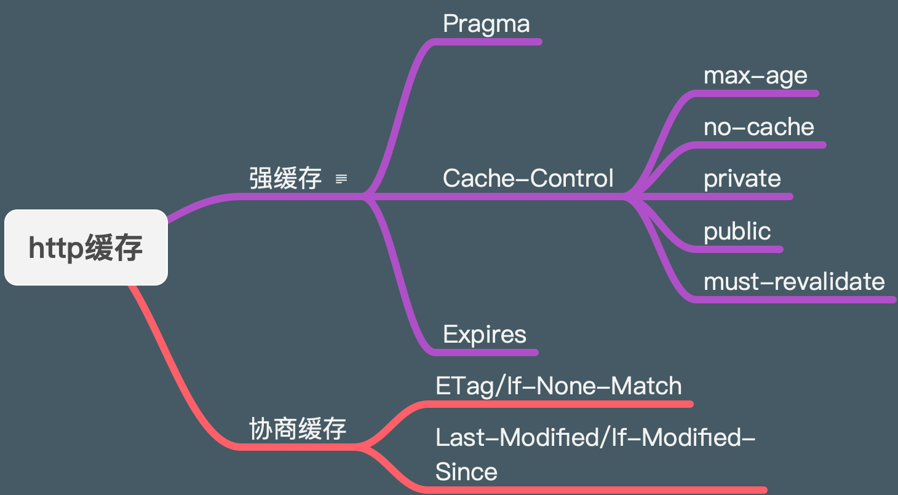

> 这是一篇之前在公司做 http 协议相关知识做的背景知识储备，期间看过《http 权威指南》 《图解 http》, 都是不错的书籍，查阅了 mdn 和 不同社区博客的文章，作出了以下记录。 分享的 keynote 在这里可以[下载](../../keynote/http.key)。

## http 是什么？

http 全称是超文本传输协议。 负责 server 和 client 端进行通信的。http 也是一个不断迭代的一个协议，从最初的 0.9 版本开始，现在 1.1 版本使用的最为广泛。

http 各版本特性如下：

- http 0.9
  简单的 server 和 client 的交互文本协议。
- http 1.0
  基于 http 0.9 的基础上引入了 header 和 返回码，支持了一些方法，但是还不够。
- http 1.1
  在 http 1.0 的基础上完善了一些方法，增加了分块传输，还有引入了长连接，避免的重复打开关闭 tcp 连接，影响性能消耗。
- http 2
  引入了多路复用，头部压缩，二进制分帧层。还有 server 端的主动 push，可以主动将 client 端需要的资源推送过来。
- http3
  还在发展过程中，没有统一的实现。下面有几篇是不同大厂发出来的文章，可以自行查阅一下。

  [HTTP/3 原理实战](https://cloud.tencent.com/developer/article/1634011)  
  [HTTP 的发展 - HTTP | MDN](https://developer.mozilla.org/zh-CN/docs/Web/HTTP/Basics_of_HTTP/Evolution_of_HTTP)


> **多个 Tcp 连接=>keep-alive=>管道化=>多路复用**

1. 多个 tcp 连接 短连接： 每次只能传输一个请求，收到响应，请求结束后关闭连接。下次请求来时，重新开启连接。 每个请求的连接都是独立的，都会有一次 tcp 的握手耗费时间。缺点：每次开启关闭连接，消耗太大，浪费性能和等待时间：
2. 长连接： 保持连接。keep-Alive 会设置一个长连接保持一段时间，在此时间内发送的 http 请求都可以重复使用这个连接，减少 tcp 握手的时间。（或者是设置请求次数）。缺点是存在阻塞问题,受限于 http 请求的 **FIFO**结构。（队列结构）
3. 管线化： 将多个请求合并为一组，减少等待时间。但是还是存在阻塞问题，并且不是所有的请求都支持管线化（只有幂等的请求才支持）因为流水线的内容要被重试。存在很多问题，很多浏览器不开启以及代理不支持。
4. 多路复用 ，在 HTTP2 中，相同域名下的所有通信都在一个连接上完成，这个连接中可以承载任意数量的双向流。这些流都是以消息的形式被发送的，同时消息又由一个或多个帧组成。多个帧之间可以乱序发送，最后根据帧首部的流标识重新组装。  
   [HTTP2 学习(四)—HTTP2 的新特性 · 小路口](https://jiaolonghuang.github.io/2015/08/16/http2/)

---

> **HTTP/方法的幂等性**：是指一次和多次请求某一个资源应该具有同样的副作用。(get head put delete)
> 幂等性的请求，实际上就是多次操作都不会改变结果的请求，比如 GET，我可以多次从同一个地方获取资源，但是对于资源本身来说并不会发生什么变化，我 GET10 次和 GET100 次，资源都没有发生任何变化。而 post 则不同了，我提交表单 10 次，和 100 次，造成的结果是不同的，至少数据库里新增的数据有不同。

### http 组件系统


请求从 client 端发起，中间的 proxy 均可以返回信息，这个 proxy 称为代理。这个代理可为浏览器，也可以指其他东西（比如是爬虫，或者是缓存服务器）。

1. Client： user-agent
   客户端，指可以发起请求的一端，通常指的是浏览器或者 app，包括程序员自己使用的开发工具，常见的如 终端 curl , postman。
2. Web server
   指的是服务器，返回用户请求所需要的结果，通常指的是一个虚拟的机器，也有可能是通过负载均衡的一组服务器组成的计算机集群。或者是通过向其他计算机发起请求获取资源。（比如 oss 存储服务）


3. Proxy
   代理，在浏览器和服务器之间，很多计算机设备转发了请求，可以对请求做一些处理。

- 它们大多数是出现在传输层，网络层，物理层上对于 http 应用层而言是透明的，他们可能对性能有影响。

- 还有一部分出现在应用层上，他们可以透明或者不透明。
  常见的代理作用如下：
- 缓存（可以是公开的或者私有的，如浏览器的缓存）
- 过滤 （反病毒扫描，家长控制）
- 负载均衡 （让多个服务器服务不同的请求）
- 认证 （对不同资源进行权限管理）
- 日志记录 （允许存储历史信息）

正向代理：
正向代理在通信过程中是对 client 端透明，对 server 端不透明。解释一下就是正向代理只有客户端知道这个代理的信息，而对于服务端来讲是不知道这个代理的存在。常见的正向的比如 fq 工具或者 vpn。是通过访问代理服务器，然后让代理服务器去代理自己发送请求，然后拿到结果。

反向代理：
反向代理在通信过程中是对 server 端透明，对 client 端不透明。解释一下就是反向代理只有服务端知道这个代理的信息，而对于客户端来讲是不知道这个代理的存在。常见的如负载均衡，客户端发送一个请求，服务端通过负载均衡将客户端的请求分配到不同的代理服务器，但是客户端并不知道这个代理服务器的存在。

### http 的特点

1. 简单
   http 的报文是刻度的，还可以简单测试，降低了门槛。
2. 可扩展
   可通过 http headers 对 http 协议进行扩展，只需要服务端和客户端达成语意一致，就可以实现很多新的功能。
3. 无状态，有会话
   http 是无状态的，为了记住状态，一般都是通过 cookie 的机制来实现状态的管理。每次请求浏览器会将 cookie 放在头部，创建一个会话让每次请求都能共享相同的上下文信息。
   [典型的 HTTP 会话 - HTTP | MDN](https://developer.mozilla.org/zh-CN/docs/Web/HTTP/Session)

### http 特性

- 缓存
  

- [HTTP 缓存 - HTTP | MDN](https://developer.mozilla.org/zh-CN/docs/Web/HTTP/Caching_FAQ)

- [HTTP 缓存  |  Web Fundamentals  |  Google Developers](https://developers.google.com/web/fundamentals/performance/optimizing-content-efficiency/http-caching?hl=zh-cn)
- [图解 HTTP 缓存 - 掘金](https://juejin.im/post/6844904153043435533#heading-6)
- [前端重定向，index.html 文件被浏览器缓存，导致整个应用都是旧的 · Issue #1365 · ant-design/ant-design-pro · GitHub](https://github.com/ant-design/ant-design-pro/issues/1365)

- 开放同源限制
  为了 web 网站的安全，浏览器对 web 网站做了分割限制。只有来自于相同来源的网页才能获取网站的全部信息。但是可以通过修改头部来开放这样的限制。
- 认证
- 代理和隧道 [[正向代理与反向代理的区别]]
- 会话

### http 报文

一个常见的 http 请求报文如下：

1. 请求部分

```shell
> GET / HTTP/1.1
> Host: www.baidu.com
> User-Agent: curl/7.64.1
> Accept: */*
>
```

第一行为请求行部分， get 为请求方法，/是路径， http 1.1 是版本号
第二行为请求头， host 为请求的 host
第三行为用户请求的应用程序类型
第四行为浏览器可以接受的了下
第五行为上传数据，因为上传数据没有，所以为空。

2. 响应部分

```shell
 HTTP/1.1 200 OK
< Accept-Ranges: bytes
< Cache-Control: private, no-cache, no-store, proxy-revalidate, no-transform
< Connection: keep-alive
< Content-Length: 2443
< Content-Type: text/html
< Date: Mon, 31 Aug 2020 03:33:40 GMT
< Etag: "58860410-98b"
< Last-Modified: Mon, 23 Jan 2017 13:24:32 GMT
< Pragma: no-cache
< Server: bfe/1.0.8.18
< Set-Cookie: BDORZ=27315; max-age=86400; domain=.baidu.com; path=/
<
<!DOCTYPE html>
```

## 应用

1. chrome 查看请求
2. postman 发送请求
3. Charles 使用

### https

Https 是 http + tls 的称呼，为了防止 http 通信过程中存在的下列风险

1. 窃听风险：第三方可以获知通信内容
2. 篡改风险： 第三方可以修改通信内容
3. 冒充风险： 第三方可以冒充他人参与通信

ssl/tls 为了解决三大风险设计

1. 所有信息都是加密传播，第三方无法窃听。
2. 具有校验机制，一旦被篡改，通信双方会立刻发现
3. 配备身份证书，防止身份被冒充


Https 采用的混合加密机制
在传递密钥的时候采用非对称加密，然后使用对称的密钥加密要加密要传递的信息，这样就避免的第三方的攻击者获取到密钥。

> [HTTPS 温故知新（一） —— 开篇](https://halfrost.com/https-begin/)  
> [HTTPS-digital-certificate.md](https://github.com/halfrost/Halfrost-Field/blob/master/contents/Protocol/HTTPS-digital-certificate.md)
