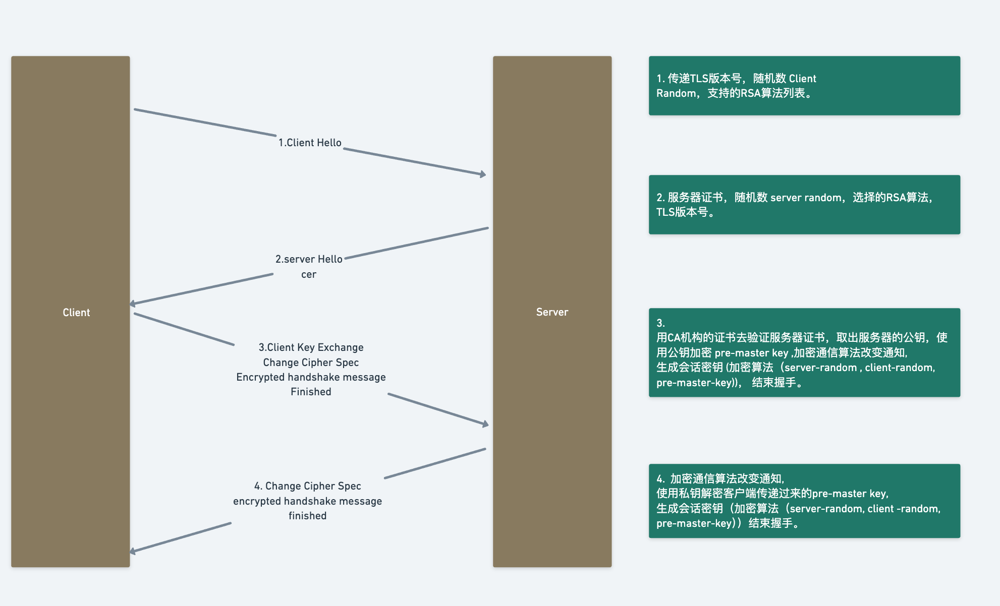
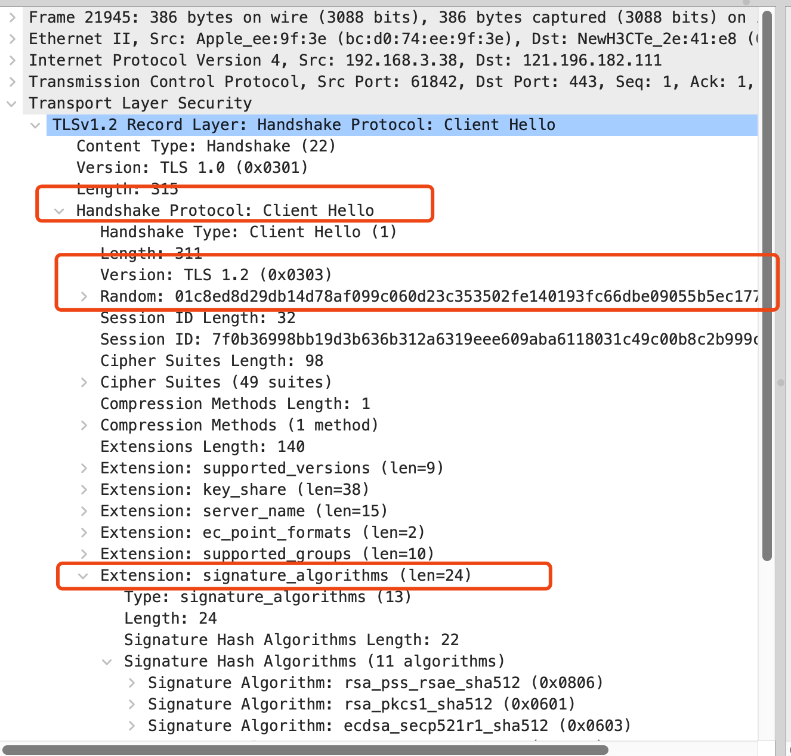
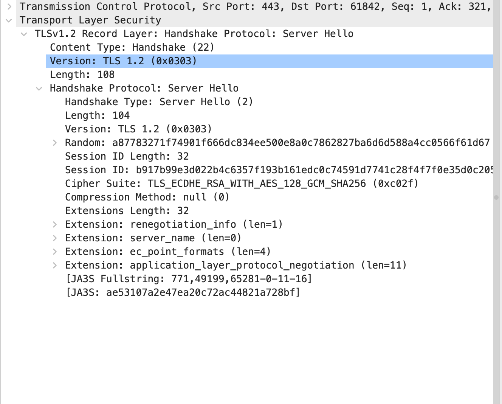

# tls 的通信过程

http 通信的时候都是明文的，所以会导致不安全，那么通过 tls 的加密，就可以保障我们信息传输的安全性，那它是如何保障的，这篇文章从我之前记的笔记里面提取出来，来记录一下这个流程。

## 一共有四次过程

1. 客户端发送请求，发送客户端随机数，和支持的 tls 版本，以及加密算法的列表。
2. 服务端接收请求后，返回服务端随机数，选择的 tls 版本，和加密算法，还有服务器证书。
3. 客户端接收后，拿到服务器证书去到 ca 机构校验，校验成功后取得 ca 证书的公钥，然后生成一个随机数，通过公钥加密这个随机数（pre-master-key），发送给服务端，并告知加密通信算法改变。
4. 服务器接收后，通过私钥解密这个 pre-master-key，拿到随机数，然后通过前述约定好的加密算法，使用 pre-master-key + 客户端随机数+ 服务端随机数 生成一个新的会话密钥，客户端也会同样的生成这个会话密钥。后续的通信都是通过这个密钥进行加解密。

公私钥的用途只是用来加解密 pre-master-key 的，并不做其他用途。

后续消息的传递都是通过对称加密来完成的，因为非对称加密非常耗费性能。

## wireshark 抓包

    我们可以通过wireshark抓包来仔细观察这个过程

### client hello

如上述截图所表示，有几个关键信息

1. client random num：
   01c8ed8d29db14d78af099c060d23c353502fe140193fc66dbe09055b5ec1773
2. tls 1.2
3. 支持的 ras 算法列表

### Server hello

1. Server random num:

   a87783271f74901f666dc834ee500e8a0c7862827ba6d6d588a4cc0566f61d67

2. Cipher Suite: TLS_ECDHE_RSA_WITH_AES_128_GCM_SHA256 (0xc02f)
   发送证书和加密算法

3. Certificate server hello done
