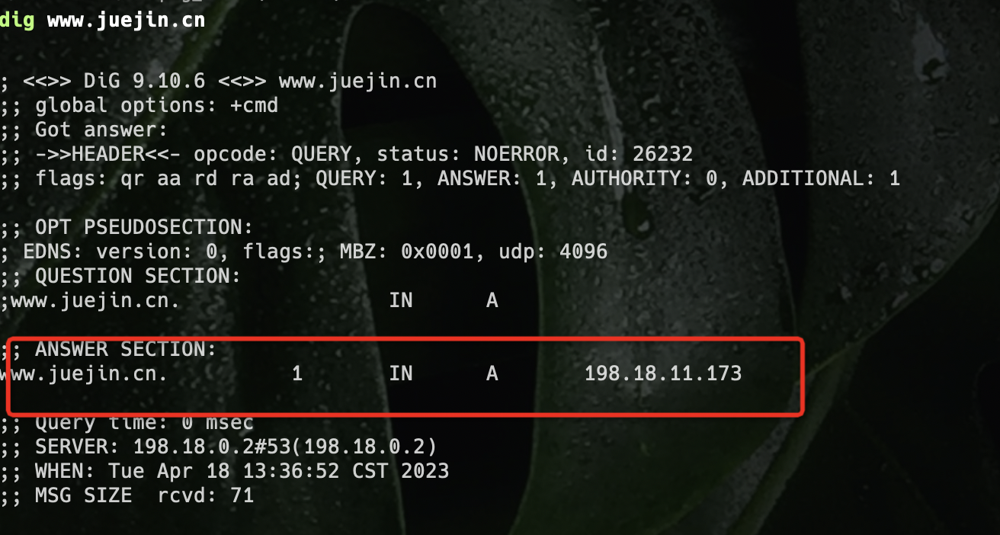
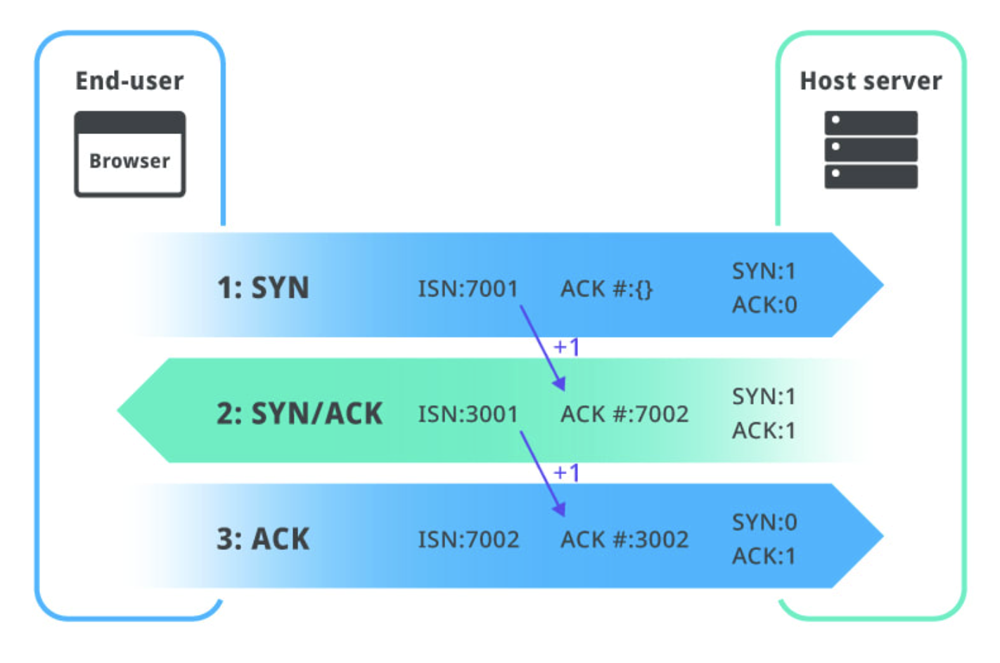

# 浏览器如何工作

## 导航

### dns 查找

Dns 查找指的是我们在浏览器上输入域名，然后 dns 服务器会返回给我们域名所指向的 ip。

### TCP 的三次握手

[[tcp]]

### TLS 的三次握手

[tls 握手过程](https://whimsical.com/tls-GkMMZE5WkdreQpJSRsXyJM)

## 获取资源

获取请求资源

1. 发送 http 请求
2. 接受 http 响应
3. 渲染 HTML

解析 html，生成 dom 树

解析 css 生成 css 树

执行 js 文件 （阻塞渲染）

生成渲染树

### 布局阶段

布局 渲染树，修改渲染树元素的尺寸和位置计算等

### 绘制阶段

绘制 渲染树，绘制页面的像素信息，重绘 透明度或者颜色还有能见度（visibility）

### 图层合成

将默认涂层和复合图层交给 gpu 进程，将各个图层合成后，显示出页面

### 资源文章

[图解浏览器的多进程渲染机制](https://mp.weixin.qq.com/s/6QR7niKFHY4StFZwDRfyKQ)
[译 现代浏览器内部揭秘（第一部分） - 掘金](https://juejin.cn/post/6844903679389073415)
[译 现代浏览器内部揭秘（第二部分） - 掘金](https://juejin.cn/post/6844903692890537992)
[译 现代浏览器内部揭秘（第三部分） - 掘金](https://juejin.cn/post/6844903692894732295)
[译 现代浏览器内部揭秘（第四部分） - 掘金](https://juejin.cn/post/6844903695600058375)
